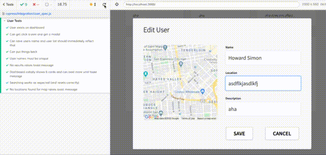

# Overview: 
## Front-End Client (React)

A **React** front-end built with **react-bootstrap** that uses **Apollo-client** to communicate with a GraphQL backend, and interacts with the Google Maps API (requires an API key) via `google-maps-react` and `react-geocode`.

This project includes **Cypress End-to-End** (e2e) tests.

# How to install

```sh
# change directory into the front-end subdirectory
cd fe

# install all libraries
npm i
```

# Quick Start

You will need to grab a `.env` environment variable file:
```
🛑 Both the front-end and the back-end will not work without the correct .env files!
```

```sh
# start the app locally
npm start
```

Open [http://localhost:3000](http://localhost:3000) to view it in the browser.


# Libraries Used

- `@apollo/client`
- `react-bootstrap`
- `graphql`
- `lodash`
- `moment`
- `google-maps-react`
- `react-geocode`

# Testing

End-to-End (e2e) testing via Cypress is included with this project, and can be found in the `cypress` subdirectory.

Testing is only for local environments at this stage, so:
```
🛑 Both the front-end and the back-end MUST BE RUNNING locally for the tests to work!
```

```sh
# open Cypress testing tool
npm test
```


Then to run all tests, click the `user_spec.js` test file, and you should see:




