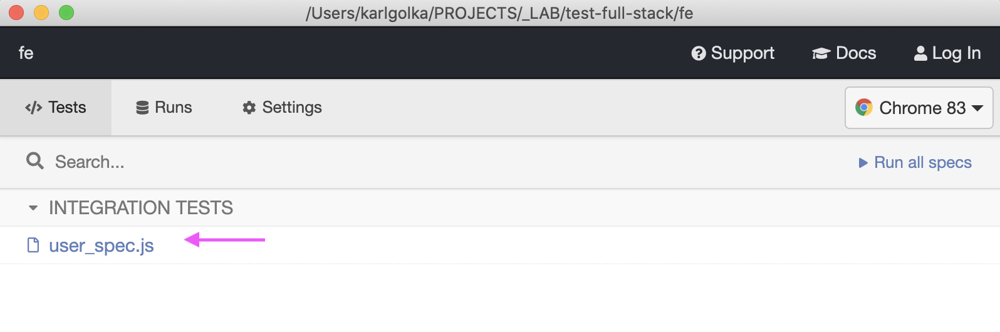

😀 Write clear **documentation** on how the app was designed and how to run the code.
😀 ONE LINER INTRO: I want you to explain the value it brings to a specific type of person/company. 
😀 clean up all this CRA shit...

# Overview: 
## Front-End Client (React)

A **React** front-end built with **react-bootstrap** that uses **Apollo-client** to communicate with a GraphQL backend, and interacts with the Google Maps API (requires an API key) via `google-maps-react` and `react-geocode`.

This project includes **Cypress End-to-End** (e2e) tests.

# How to install

```sh
# change directory into the front-end subdirectory
cd fe

# install all libraries
npm i
```

# Quick Start

```sh
# start the app locally
npm start
```

Open [http://localhost:3000](http://localhost:3000) to view it in the browser.


# Libraries Used

- `@apollo/client`
- `react-bootstrap`
- `graphql`
- `lodash`
- `moment`
- `google-maps-react`
- `react-geocode`


# Testing

End-to-End (e2e) testing via Cypress is included with this project, and can be found in the `cypress` subdirectory.

Testing is only for local environments at this stage, so:
```
🛑 Both the front-end and the back-end MUST BE RUNNING locally for the tests to work!
```

```sh
# open Cypress testing tool
npm test
```



Then to run all tests, click the `user_spec.js` test file, and you should see:


## Available Scripts

In the project directory, you can run:

### `npm start`

Runs the app in the development mode.<br />
Open [http://localhost:3000](http://localhost:3000) to view it in the browser.

The page will reload if you make edits.<br />
You will also see any lint errors in the console.

### `npm test`

Launches the test runner in the interactive watch mode.<br />
See the section about [running tests](https://facebook.github.io/create-react-app/docs/running-tests) for more information.

### `npm run build`

Builds the app for production to the `build` folder.<br />
It correctly bundles React in production mode and optimizes the build for the best performance.

The build is minified and the filenames include the hashes.<br />
Your app is ready to be deployed!

See the section about [deployment](https://facebook.github.io/create-react-app/docs/deployment) for more information.

### `npm run eject`

**Note: this is a one-way operation. Once you `eject`, you can’t go back!**

If you aren’t satisfied with the build tool and configuration choices, you can `eject` at any time. This command will remove the single build dependency from your project.

Instead, it will copy all the configuration files and the transitive dependencies (webpack, Babel, ESLint, etc) right into your project so you have full control over them. All of the commands except `eject` will still work, but they will point to the copied scripts so you can tweak them. At this point you’re on your own.

You don’t have to ever use `eject`. The curated feature set is suitable for small and middle deployments, and you shouldn’t feel obligated to use this feature. However we understand that this tool wouldn’t be useful if you couldn’t customize it when you are ready for it.

## Learn More

You can learn more in the [Create React App documentation](https://facebook.github.io/create-react-app/docs/getting-started).

To learn React, check out the [React documentation](https://reactjs.org/).

### Code Splitting

This section has moved here: https://facebook.github.io/create-react-app/docs/code-splitting

### Analyzing the Bundle Size

This section has moved here: https://facebook.github.io/create-react-app/docs/analyzing-the-bundle-size

### Making a Progressive Web App

This section has moved here: https://facebook.github.io/create-react-app/docs/making-a-progressive-web-app

### Advanced Configuration

This section has moved here: https://facebook.github.io/create-react-app/docs/advanced-configuration

### Deployment

This section has moved here: https://facebook.github.io/create-react-app/docs/deployment

### `npm run build` fails to minify

This section has moved here: https://facebook.github.io/create-react-app/docs/troubleshooting#npm-run-build-fails-to-minify
